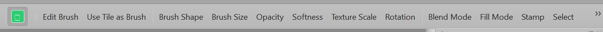

# Brushtily - Inkarnate-inspired Texture Painting for Tiled

[](https://www.mapeditor.org/)
[](LICENSE)

A powerful plugin bridging freeform brushing into Tiled with easy object placement. This JavaScript extension adds Inkarnate-inspired freeform brushing and object stamping capabilities, enabling smooth, non-grid-aligned brush strokes for creating beautiful terrain and textures.



*Brushtily toolbar integrated into Tiled Map Editor, showing all brush controls and layer management*

## Features

### Texture Painting
- **Freeform Brush Strokes**: Paint with non-grid-aligned brush strokes
- **Custom Brush Textures**: Load PNG/JPG images as brush textures
- **Tileset Tile Brushes**: Use tiles from your tilesets directly as brush textures
- **Multiple Brush Shapes**: Circular, Square, Ellipse, or Diamond brush shapes

### Adjustable Brush Properties
- **Brush Size** (10-500 pixels) - Adjustable brush diameter
- **Opacity** (0-100%) - Control transparency of brush strokes
- **Softness** (0-100%) - Edge feathering for smooth, natural transitions
- **Texture Scale** (10-200%) - Scale texture independently from brush size
- **Rotation** (0-360 degrees) - Rotate brush texture to any angle
- **Rotation Jitter** (0-360°) - Random rotation variation for organic strokes
- **Position Jitter** (0-100) - Random position variation to prevent repetitive patterns
- **Spacing** (percentage) - Control distance between brush stamps
- **Blend Modes** (Normal, Multiply, Screen, Overlay, Darken, Lighten, etc.) - Advanced compositing
- **Mask Modes** (Add, Subtract, Multiply) - Precise control over brush interactions

### Advanced Features
- **Fill Mode**: Bucket fill with color tolerance control
- **Pressure Sensitivity**: Velocity-based simulation for natural brush strokes (affects size and opacity)
- **Right-Click Erase**: Independent erase brush with separate size and softness controls
- **Brush Presets**: Save and load favorite brush configurations
- **Layer Brush Memory**: Automatically remembers brush texture per layer

### Object Stamping System
- **Object Layer Stamping**: Drag-to-stamp workflow for easy object placement on ObjectGroup layers
- **Object Library Browser**: Visual browser with thumbnails, categories, and search functionality
- **Automatic Object Placement**: Places objects along brush stroke path
- **Random Variation**: Optional rotation and scale variation for natural object placement
- **Folder-Based Organization**: Automatically categorizes objects by folder structure

### Layer Support
- **Dual Layer Support**: Works on ImageLayer (smooth painting, immediate visual feedback) and ObjectGroup (undo support, object stamping)

## 📦 Installation

### Quick Install

1. **Download** `brushtily.mjs` from the [latest release](https://github.com/PersistenceOS/brushtily/releases) (or use the file in this repository)

2. **Copy to Tiled extensions folder**:
   - **Windows**: `%LOCALAPPDATA%\Tiled\extensions\` 
     - (Usually: `C:\Users\<USER>\AppData\Local\Tiled\extensions\`)
   - **macOS**: `~/Library/Preferences/Tiled/extensions/`
   - **Linux**: `~/.config/tiled/extensions/`

3. **Restart Tiled** (or the extension will auto-reload on file change)

4. **Verify**: The "Brushtily" tool should appear in the Tools toolbar

### Verify Installation

- Open Tiled
- Check Tools toolbar for "Brushtily" tool icon
- If not visible, check Tiled Console (View → Views → Console) for errors

## Usage

### Basic Painting

1. Select an ImageLayer or ObjectGroup layer
2. Activate the Brushtily tool from the toolbar
3. Click and drag to paint with the brush

### Loading Brush Textures

1. Click "Edit Brush" in the tool panel (or use the action)
2. Click "Select New Texture"
3. Choose a PNG or JPG image file
4. The texture will be cached and used for painting

### Adjusting Brush Properties

Use the toolbar actions to adjust:
- **Brush Size**: Controls overall brush diameter
- **Opacity**: Controls transparency
- **Softness**: Controls edge feathering (0 = hard edge, 100 = fully feathered)
- **Texture Scale**: Scales the texture within the brush (independent of brush size)
- **Rotation**: Rotates the brush texture
- **Blend Mode**: Changes how the brush composites with existing pixels

### Fill Mode

1. Toggle "Fill Mode" button
2. Click on an area to fill it with the current brush
3. Fill tolerance can be adjusted (default: 32)

### Object Layer Stamping

1. Select an ObjectGroup layer
2. Toggle "Stamp" mode (or use the action)
3. Open "Library" to browse and select an object image
4. Click and drag to stamp objects along your brush path
5. Objects are automatically placed with optional random rotation and scale variation

### Saving Presets

1. Configure your brush settings
2. Click "Presets" button
3. Enter a name and click "Save"
4. Load presets from the dropdown

## Technical Details

- **File Format**: ES Module (`.mjs`) - no global scope pollution
- **Layer Support**: ImageLayer (immediate visual feedback, no undo) and ObjectGroup (undo support)
- **Performance**: Optimized with point density limiting and update throttling
- **Pressure Simulation**: Uses velocity-based calculation (faster movement = lighter pressure)

## Known Limitations

- ImageLayer painting has no undo support (per Tiled API limitations)
- Use ObjectGroup mode for undo support (creates MapObjects for each stamp)
- Tablet pressure not available in Tiled API - uses velocity simulation instead
- Complex blend modes may have performance impact with large brushes

## File Structure

```
extensions/
  brushtily.mjs          # Main plugin file
  brushtily/
    presets.json         # Saved brush presets (auto-created)
    brushes/             # Optional: default brush textures
```

## 🚀 Quick Start

1. Create or open a map in Tiled
2. Add an **Image Layer** (Layer → Add Image Layer)
3. Select the **Brushtily** tool from the toolbar
4. Click **"Edit Brush"** → **"Select New Texture"** to load a brush texture
5. Click and drag to paint!

## 📋 Requirements

- **Tiled 1.8 or later** (JavaScript extensions support required)
- JavaScript extensions enabled (default in Tiled)

## 🐛 Troubleshooting

**Tool not appearing?**
- Check Tiled Console (View → Views → Console) for errors
- Verify file is in correct extensions folder
- Ensure file is named `brushtily.mjs` (not `.js`)

**Brush not painting?**
- Make sure you have an **Image Layer** selected (not Tile Layer)
- Check that layer is visible and unlocked
- Verify brush texture is loaded (Edit Brush → Select New Texture)

**Performance issues?**
- Reduce brush size for large maps
- Disable debug logging (set `debugEnabled: false` in code)
- Close other applications to free up memory

## 📄 License

This project is licensed under the MIT License - see [LICENSE](LICENSE) file for details.

## 🤝 Contributing

Contributions welcome! Please feel free to submit issues, feature requests, or pull requests.

## 🙏 Acknowledgments

- Inspired by Inkarnate's freeform brushing and object stamping workflow
- Built for the Tiled Map Editor community
- Uses Tiled's JavaScript Extension API

## 👨‍💻 Credits

**Created by:** Leo Louvar

**Developed with:** [PersistenceAI](https://persistence-ai.github.io/Landing/) via 1 hour of vibe coding using model GLM 4.7 and human review

This project was programmed and created using [PersistenceAI](https://persistence-ai.github.io/Landing/)'s advanced AI-assisted development workflow, demonstrating the power of AI-human collaboration in software development. Built in just 1 hour of vibe coding with GLM 4.7, followed by human review and refinement.

**Learn more about PersistenceAI:** Visit [https://persistence-ai.github.io/Landing/](https://persistence-ai.github.io/Landing/) - The AI coding agent built for the terminal.

## 📞 Support

- **Issues**: Report bugs or request features on [GitHub Issues](https://github.com/PersistenceOS/brushtily/issues)
- **Questions**: Ask on [Tiled Forums](https://discourse.mapeditor.org/)
- **Email**: Contact us at PersistenceAI@proton.me
